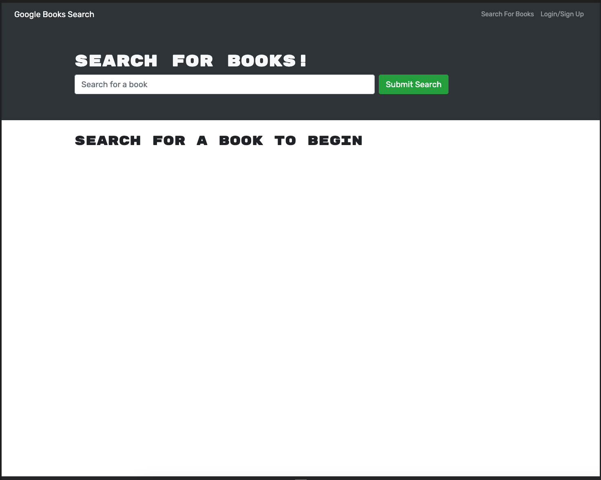
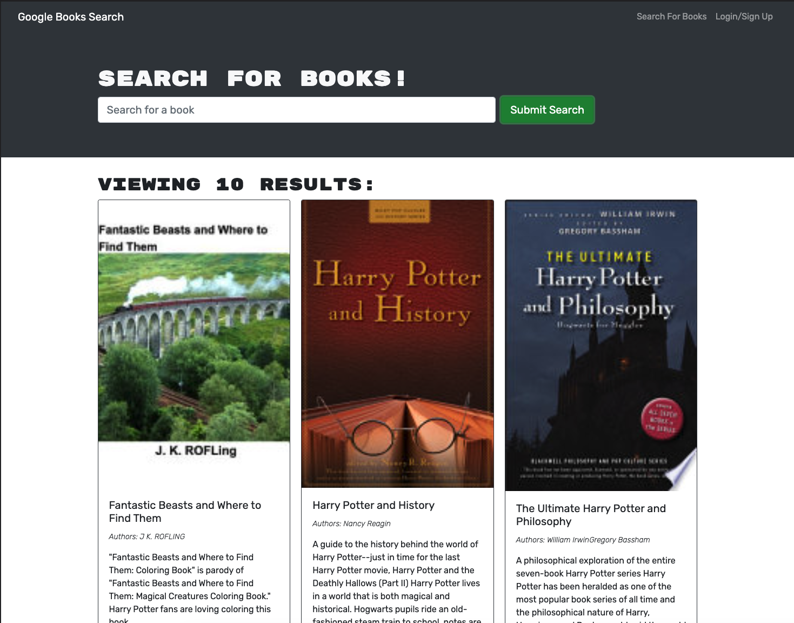
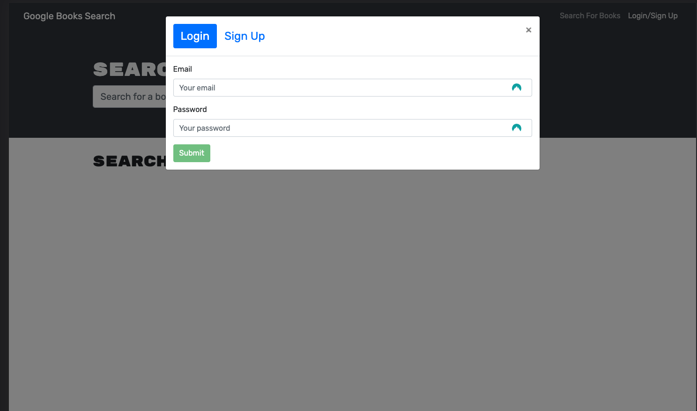

# My-Book-Search-Engine

  
## Description:

This full stack application is a Book search engine. The app allows a user to create and account and search for books. If the user creates an accound the user can save books that are searched. 

## Table of Contents:
- [My-Book-Search-Engine](#my-book-search-engine)
  - [Description:](#description)
  - [Table of Contents:](#table-of-contents)
- [Overview](#overview)
  - [The Task](#the-task)
  - [The Challenge:](#the-challenge)
  - [User Story](#user-story)
  - [Acceptance Criteria](#acceptance-criteria)
  - [Usage Instructions](#usage-instructions)
  - [Repository Link:](#repository-link)
  - [Deployed Applicaiton](#deployed-applicaiton)
  - [Screenshots.](#screenshots)
    - [Figure 1 Application text editor](#figure-1-application-text-editor)
  - [Installation Process](#installation-process)
  - [Built With](#built-with)
  - [What I Learned](#what-i-learned)
  - [Author](#author)

# Overview

## The Task

## The Challenge:
Your Challenge this week is emblematic of the fact that most modern websites are driven by two things: data and user demands. This shouldn't come as a surprise, as the ability to personalize user data is the cornerstone of real-world web development today. And as user demands evolve, applications need to be more performant.

This week, you’ll take a fully functioning Google Books API search engine built with a RESTful API, and refactor it to be a GraphQL API built with Apollo Server. The app was built using the MERN stack, with a React front end, MongoDB database, and Node.js/Express.js server and API. It's already set up to allow users to save book searches to the back end.

## User Story
```md
AS AN avid reader
I WANT to search for new books to read
SO THAT I can keep a list of books to purchase
```

## Acceptance Criteria
```md
GIVEN a book search engine
WHEN I load the search engine
THEN I am presented with a menu with the options Search for Books and Login/Signup and an input field to search for books and a submit button
WHEN I click on the Search for Books menu option
THEN I am presented with an input field to search for books and a submit button
WHEN I am not logged in and enter a search term in the input field and click the submit button
THEN I am presented with several search results, each featuring a book’s title, author, description, image, and a link to that book on the Google Books site
WHEN I click on the Login/Signup menu option
THEN a modal appears on the screen with a toggle between the option to log in or sign up
WHEN the toggle is set to Signup
THEN I am presented with three inputs for a username, an email address, and a password, and a signup button
WHEN the toggle is set to Login
THEN I am presented with two inputs for an email address and a password and login button
WHEN I enter a valid email address and create a password and click on the signup button
THEN my user account is created and I am logged in to the site
WHEN I enter my account’s email address and password and click on the login button
THEN I the modal closes and I am logged in to the site
WHEN I am logged in to the site
THEN the menu options change to Search for Books, an option to see my saved books, and Logout
WHEN I am logged in and enter a search term in the input field and click the submit button
THEN I am presented with several search results, each featuring a book’s title, author, description, image, and a link to that book on the Google Books site and a button to save a book to my account
WHEN I click on the Save button on a book
THEN that book’s information is saved to my account
WHEN I click on the option to see my saved books
THEN I am presented with all of the books I have saved to my account, each featuring the book’s title, author, description, image, and a link to that book on the Google Books site and a button to remove a book from my account
WHEN I click on the Remove button on a book
THEN that book is deleted from my saved books list
WHEN I click on the Logout button
THEN I am logged out of the site and presented with a menu with the options Search for Books and Login/Signup and an input field to search for books and a submit button  
```


## Usage Instructions

1. use the deployed link to access the site on heroku. 
2. Create and account.
3. start searching and saving books.


## Repository Link:
[Repository Link 'Click Here'.](https://github.com/MaxKeable/Book-Search)

## Deployed Applicaiton 
[Click Here to view deployed app.](******************)

## Screenshots.
### Figure 1 Application text editor







## Installation Process
1. Clone git repo.
2. install dependencies.
3. run npm run develop in parent directory.

## Built With

- GraphQl
- Appolo 
- JavaScript
- Node.js: [Version 16.18.1](https://nodejs.org/en/blog/release/v16.18.1/)
- Express.js:[Express.js](https://expressjs.com/en/starter/installing.html)
- Nodemon: [2.0.12](https://www.npmjs.com/package/nodemon/v/2.0.12)
- Visual Studio Code: [Website](https://code.visualstudio.com/)

## What I Learned
1. How to create a full stack MERN app
2. How to use GraphyQL
3. and how to use Appolo

## Author

Follow me on Github at [MaxKeable](https://github.com/MaxKeable)! Additional questions or concerns? feel free to contact me at keabledev@gmail.com


© 2023 [MaxKeable](https://github.com/MaxKeable). Confidential and Proprietary. All Rights Reserved.